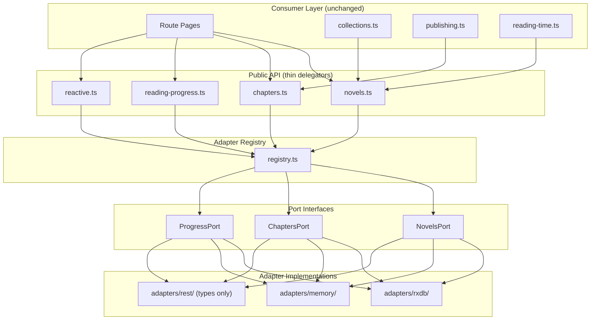

# Design Document: Data Layer Ports

## Overview

This design introduces a hexagonal (ports/adapters) architecture to the novel app's data layer at `apps/novel/src/lib/data/`. The current implementation hardwires RxDB throughout — `database.ts` creates a singleton, `reactive.ts` subscribes directly to RxDB collections, and `novels.ts`/`chapters.ts` read from a cache populated by `init.ts`. This refactoring defines TypeScript interfaces (ports) for each data concern, then provides pluggable adapter implementations behind those interfaces.

The refactoring is non-breaking: the public API surface (`novels.ts`, `chapters.ts`, `reading-progress.ts`, `reactive.ts`, `index.ts`) retains identical export signatures. Consumers continue importing from `$lib/data` without modification. The change is internal — function bodies become thin delegations to the active adapter obtained from a runtime registry.

### Goals

- **Testability**: Enable fast, browser-free unit tests via an in-memory adapter
- **Extensibility**: Allow future adapters (REST for readers) without touching consumers
- **Zero regression**: Public API stays identical; existing route pages, `collections.ts`, `publishing.ts` all work unchanged
- **Minimal code movement**: RxDB adapter wraps existing logic in-place rather than rewriting it

## Architecture



### Key Design Decisions

1. **Single registry, bundled ports**: The registry returns a `DataPorts` object containing all three port implementations together (not separately switchable). This simplifies the common case while still allowing different adapters per context (author vs reader) via named registrations.

2. **Adapters own initialization**: Each adapter's `init()` handles its own setup (RxDB creates the database, memory does nothing or pre-loads data). The registry calls `init()` once on first activation.

3. **Observables as port methods**: Reactive queries (`novels$`, `chapters$`, `progress$`) are methods on the port interfaces, not separate modules. This keeps the observable contract adapter-specific (RxDB uses native `.$` subscriptions; memory uses BehaviorSubjects).

4. **RxDB adapter = relocated existing code**: The RxDB adapter implementation is the existing `database.ts`, `schemas.ts`, and `init.ts` logic moved into `adapters/rxdb/`. Minimal rewrite — mostly re-exports and function delegation.

5. **Seed data uses port methods**: `seed.ts` accepts a `DataPorts` parameter and calls `createNovel`/`createChapter` rather than `db.novels.bulkInsert`. This makes seed data adapter-agnostic.

## Components and Interfaces

### Directory Structure

```
src/lib/data/
├── ports/
│   ├── index.ts              # Re-exports all ports and DataPorts type
│   ├── novels.port.ts        # NovelsPort interface
│   ├── chapters.port.ts      # ChaptersPort interface
│   └── progress.port.ts      # ProgressPort interface
├── adapters/
│   ├── rxdb/
│   │   ├── index.ts          # RxDB adapter factory
│   │   ├── rxdb-novels.ts    # NovelsPort implementation
│   │   ├── rxdb-chapters.ts  # ChaptersPort implementation
│   │   ├── rxdb-progress.ts  # ProgressPort implementation
│   │   ├── database.ts       # Existing DB init (moved from data/)
│   │   └── schemas.ts        # Existing schemas (moved from data/)
│   ├── memory/
│   │   ├── index.ts          # Memory adapter factory
│   │   ├── memory-novels.ts  # NovelsPort implementation
│   │   ├── memory-chapters.ts# ChaptersPort implementation
│   │   └── memory-progress.ts# ProgressPort implementation
│   └── rest/
│       ├── index.ts          # Type skeleton + placeholder factory
│       └── types.ts          # REST API shape definitions
├── registry.ts               # Adapter registry
├── novels.ts                 # Public API (delegates to registry)
├── chapters.ts               # Public API (delegates to registry)
├── reading-progress.ts       # Public API (delegates to registry)
├── reactive.ts               # Public API (delegates to registry observables)
├── init.ts                   # initDataLayer() orchestrator
├── seed.ts                   # Adapter-agnostic seed using port methods
├── index.ts                  # Barrel exports (unchanged surface)
├── storage.ts                # uid() utility (unchanged)
├── collections.ts            # Unchanged (consumes public API)
├── reading-time.ts           # Unchanged (pure functions)
├── authors.ts                # Unchanged (static data)
├── publishing.ts             # Unchanged (consumes public API)
├── replication.ts            # Unchanged (stub)
└── migrate-localstorage.ts   # Unchanged (called by RxDB adapter)
```

### Port Interfaces

#### NovelsPort

```typescript
// ports/novels.port.ts
import type { Observable } from 'rxjs'
import type { NovelMeta } from '@cosmonexus/nova-types'

export type CreateNovelData = {
  title: string
  author: string
  genre?: string
  synopsis?: string
  coverUrl?: string
  targetWordCount?: number
}

export type UpdateNovelData = Partial<Omit<NovelMeta, 'id' | 'createdAt' | 'chapters'>>

export interface NovelsPort {
  init(): Promise<void>

  // Sync reads (from cache)
  listNovels(): NovelMeta[]
  getNovel(id: string): NovelMeta | null

  // Async mutations
  createNovel(data: CreateNovelData): Promise<NovelMeta>
  updateNovel(id: string, updates: UpdateNovelData): Promise<NovelMeta | null>
  deleteNovel(id: string): Promise<void>

  // Reactive queries
  novels$(): Observable<NovelMeta[]>
  novel$(id: string): Observable<NovelMeta | null>
}
```

#### ChaptersPort

```typescript
// ports/chapters.port.ts
import type { Observable } from 'rxjs'
import type { ChapterMeta, ChapterStatus, DocumentJSON } from '@cosmonexus/nova-types'

export type CreateChapterData = {
  title: string
  targetWordCount?: number
}

export type UpdateChapterData = Partial<Pick<ChapterMeta, 'title' | 'status' | 'targetWordCount'>>

export interface ChaptersPort {
  // Sync reads (from cache)
  listChapters(novelId: string): ChapterMeta[]
  getChapterMeta(novelId: string, chapterId: string): ChapterMeta | null

  // Async reads
  getChapterContent(novelId: string, chapterId: string): Promise<DocumentJSON | null>

  // Async mutations
  createChapter(novelId: string, data: CreateChapterData): Promise<ChapterMeta | null>
  saveChapterContent(novelId: string, chapterId: string, content: DocumentJSON, wordCount: number): Promise<void>
  updateChapter(novelId: string, chapterId: string, updates: UpdateChapterData): ChapterMeta | null
  deleteChapter(novelId: string, chapterId: string): Promise<void>
  reorderChapters(novelId: string, orderedIds: string[]): Promise<void>

  // Reactive queries
  chapters$(novelId: string): Observable<ChapterMeta[]>
}
```

#### ProgressPort

```typescript
// ports/progress.port.ts
import type { Observable } from 'rxjs'
import type { ReadingProgress } from '../reading-progress'

export interface ProgressPort {
  getProgress(novelId: string): Promise<ReadingProgress | null>
  markChapterRead(novelId: string, chapterId: string): Promise<void>
  progress$(novelId: string): Observable<ReadingProgress | null>
}
```

#### DataPorts Bundle

```typescript
// ports/index.ts
import type { NovelsPort } from './novels.port'
import type { ChaptersPort } from './chapters.port'
import type { ProgressPort } from './progress.port'

export type DataPorts = {
  novels: NovelsPort
  chapters: ChaptersPort
  progress: ProgressPort
}

export type { NovelsPort, ChaptersPort, ProgressPort }
export type { CreateNovelData, UpdateNovelData } from './novels.port'
export type { CreateChapterData, UpdateChapterData } from './chapters.port'
```

### Adapter Registry

```typescript
// registry.ts
import type { DataPorts } from './ports'

export type AdapterFactory = () => DataPorts

const factories = new Map<string, AdapterFactory>()
let activeAdapter: DataPorts | null = null
let activeName: string | null = null
let initPromise: Promise<void> | null = null

export function registerAdapter(name: string, factory: AdapterFactory): void {
  factories.set(name, factory)
}

export async function setActiveAdapter(name: string): Promise<void> {
  const factory = factories.get(name)
  if (!factory) {
    throw new Error(`[data/registry] No adapter registered with name "${name}". Available: ${[...factories.keys()].join(', ')}`)
  }
  if (activeName === name && activeAdapter) return // already active

  activeAdapter = factory()
  activeName = name

  // Initialize all ports
  initPromise = activeAdapter.novels.init()
  await initPromise
}

export function getAdapter(): DataPorts {
  if (!activeAdapter) {
    throw new Error('[data/registry] No adapter is active. Call setActiveAdapter() or initDataLayer() first.')
  }
  return activeAdapter
}

export function getInitPromise(): Promise<void> | null {
  return initPromise
}
```

### Memory Adapter Implementation

The memory adapter stores data in `Map` instances and emits updates via RxJS `BehaviorSubject`. It is designed for fast, deterministic tests with no browser dependencies.

```typescript
// adapters/memory/index.ts
import type { DataPorts } from '../../ports'
import { MemoryNovelsAdapter } from './memory-novels'
import { MemoryChaptersAdapter } from './memory-chapters'
import { MemoryProgressAdapter } from './memory-progress'

export type MemoryAdapterConfig = {
  initialData?: { novels?: any[]; chapters?: any[]; progress?: any[] }
}

export function createMemoryAdapter(config: MemoryAdapterConfig = {}): DataPorts {
  const novels = new MemoryNovelsAdapter()
  const chapters = new MemoryChaptersAdapter(novels)
  const progress = new MemoryProgressAdapter()

  // Wire cross-references for chapter list in NovelMeta
  novels.setChaptersAdapter(chapters)

  return {
    novels,
    chapters,
    progress,
    // Extension: reset for test isolation
    reset() {
      novels.reset()
      chapters.reset()
      progress.reset()
    },
  } as DataPorts & { reset(): void }
}
```

Key characteristics of the memory adapter:
- **Synchronous emission**: BehaviorSubjects emit synchronously after mutations, enabling deterministic test assertions without `await` or timers
- **No browser APIs**: Zero dependency on IndexedDB, localStorage, or DOM
- **`reset()` method**: Clears all Maps and resets BehaviorSubjects for test isolation
- **Pre-loadable**: `init()` accepts initial data via configuration for setting up test fixtures

### RxDB Adapter Implementation

The RxDB adapter wraps the existing database/schema logic with minimal changes:

```typescript
// adapters/rxdb/index.ts
import type { DataPorts } from '../../ports'
import { RxDBNovelsAdapter } from './rxdb-novels'
import { RxDBChaptersAdapter } from './rxdb-chapters'
import { RxDBProgressAdapter } from './rxdb-progress'

export function createRxDBAdapter(): DataPorts {
  const novels = new RxDBNovelsAdapter()
  const chapters = new RxDBChaptersAdapter()
  const progress = new RxDBProgressAdapter()

  return { novels, chapters, progress }
}
```

The RxDB adapter's `novels.init()` is responsible for:
1. Creating the RxDB database (moved from current `database.ts`)
2. Adding collections with schemas (moved from current `database.ts`)
3. Running localStorage migration (existing `migrate-localstorage.ts`)
4. Seeding if empty (delegates to adapter-agnostic `seed.ts`)
5. Setting up cache-priming subscriptions (moved from current `init.ts`)

### REST Adapter Type Skeleton

```typescript
// adapters/rest/types.ts
export type RestEndpoints = {
  novels: {
    list: { method: 'GET'; path: '/api/novels'; response: NovelMeta[] }
    get: { method: 'GET'; path: '/api/novels/:id'; response: NovelMeta }
  }
  chapters: {
    list: { method: 'GET'; path: '/api/novels/:novelId/chapters'; response: ChapterMeta[] }
    get: { method: 'GET'; path: '/api/novels/:novelId/chapters/:id'; response: ChapterMeta }
    content: { method: 'GET'; path: '/api/novels/:novelId/chapters/:id/content'; response: DocumentJSON }
  }
  progress: {
    get: { method: 'GET'; path: '/api/progress/:novelId'; response: ReadingProgress }
    markRead: { method: 'POST'; path: '/api/progress/:novelId/chapters/:chapterId'; response: void }
  }
}
```

The REST adapter implements `NovelsPort` and `ChaptersPort` as read-only (write methods throw `Error('Not supported in read-only mode')`), and `ProgressPort` with full read-write capability. Only type definitions and interface conformance — no functional implementation.

### Public API Delegation Pattern

After refactoring, `novels.ts` becomes:

```typescript
// novels.ts (public API - thin wrapper)
import type { NovelMeta } from '@cosmonexus/nova-types'
import { getAdapter } from './registry'

export function listNovels(): NovelMeta[] {
  return getAdapter().novels.listNovels()
}

export function getNovel(id: string): NovelMeta | null {
  return getAdapter().novels.getNovel(id)
}

export async function createNovel(data: Parameters<typeof getAdapter>['novels']['createNovel'][0]): Promise<NovelMeta> {
  return getAdapter().novels.createNovel(data)
}

// ... same pattern for all other functions
```

### Init Lifecycle

```typescript
// init.ts
import { registerAdapter, setActiveAdapter } from './registry'
import { createRxDBAdapter } from './adapters/rxdb'

let initialized = false

export async function initDataLayer(adapterName: string = 'rxdb'): Promise<void> {
  if (initialized) return
  initialized = true

  // Register built-in adapters
  registerAdapter('rxdb', createRxDBAdapter)

  // Activate the selected adapter (calls init() internally)
  await setActiveAdapter(adapterName)
}
```

For testing:

```typescript
// test setup
import { registerAdapter, setActiveAdapter } from '$lib/data/registry'
import { createMemoryAdapter } from '$lib/data/adapters/memory'

beforeEach(async () => {
  const adapter = createMemoryAdapter()
  registerAdapter('memory', () => adapter)
  await setActiveAdapter('memory')
})
```

## Data Models

The port interfaces operate on domain types from `@cosmonexus/nova-types`. No new data models are introduced — the ports use the same types the app already depends on:

| Type | Source | Used By |
|------|--------|---------|
| `NovelMeta` | `@cosmonexus/nova-types` | NovelsPort (all methods) |
| `ChapterMeta` | `@cosmonexus/nova-types` | ChaptersPort (all methods) |
| `ChapterStatus` | `@cosmonexus/nova-types` | UpdateChapterData |
| `DocumentJSON` | `@cosmonexus/nova-types` | ChaptersPort (content methods) |
| `ReadingProgress` | Local type in `reading-progress.ts` | ProgressPort (all methods) |
| `Observable<T>` | `rxjs` | All reactive query methods |

### Internal Data Structures (Memory Adapter)

The memory adapter uses these internal structures:

```typescript
// Internal storage maps
novels: Map<string, StoredNovel>        // id → novel data
chapters: Map<string, StoredChapter>    // id → chapter data  
content: Map<string, DocumentJSON>      // chapterId → document content
progress: Map<string, ReadingProgress>  // novelId → progress

// BehaviorSubjects for reactivity
novels$: BehaviorSubject<NovelMeta[]>
chaptersByNovel$: Map<string, BehaviorSubject<ChapterMeta[]>>
progressByNovel$: Map<string, BehaviorSubject<ReadingProgress | null>>
```

### Internal Data Structures (RxDB Adapter)

The RxDB adapter continues using the existing `RxCollection` types:

```typescript
// Existing RxDB collections (unchanged)
novels: RxCollection<NovelDocType>
chapters: RxCollection<ChapterDocType>
progress: RxCollection<ProgressDocType>
authors: RxCollection<AuthorDocType>
```

## Correctness Properties

*A property is a characteristic or behavior that should hold true across all valid executions of a system — essentially, a formal statement about what the system should do. Properties serve as the bridge between human-readable specifications and machine-verifiable correctness guarantees.*

### Prework: Acceptance Criteria Testing Analysis

**Requirement 1 (NovelsPort Interface)**:

1.1–1.8: Interface definitions — compile-time checks, not runtime testable properties.
Classification: N/A (type system enforces these)

**Requirement 2 (ChaptersPort Interface)**:

2.1–2.9: Interface definitions — same as above.
Classification: N/A

**Requirement 3 (ProgressPort Interface)**:

3.1–3.3: Interface definitions — same as above.
Classification: N/A

**Requirement 4 (RxDB Adapter)**:

4.1: Implements interfaces — SMOKE (compile-time + one integration test)
4.2: File location — N/A (structural)
4.3: Preserves current behavior — INTEGRATION (regression tests with specific known examples)
4.4: Reactive updates via RxDB — PROPERTY (for any mutation, the observable should emit)
4.5: Init runs migrations/seeds — SMOKE
4.6: Seeds when empty — EXAMPLE

**Requirement 5 (Memory Adapter)**:

5.1: Implements interfaces — compile-time
5.2: File location — N/A
5.3: Plain TypeScript Maps — N/A (implementation detail)
5.4: Reactive updates via BehaviorSubjects — PROPERTY (for any mutation, observable emits)
5.5: No browser APIs — SMOKE (test runs in Node without browser)
5.6: reset() clears data — PROPERTY (for any state, reset produces empty state)
5.7: Pre-loading via init() config — EXAMPLE

**Requirement 6 (Adapter Registry)**:

6.1: getAdapter() returns active — PROPERTY (after setActive, getAdapter returns that adapter)
6.2: registerAdapter stores factory — EXAMPLE
6.3: setActiveAdapter switches — PROPERTY (for any registered adapter name, setActive makes it current)
6.4: Different adapters per context — EXAMPLE
6.5: Error when no adapter registered — PROPERTY (for any unregistered name, getAdapter throws)
6.6: Calls init() on first activation — EXAMPLE
6.7: Exports DataPorts type — compile-time

**Requirement 7 (Public API Delegation)**:

7.1: Same function signatures — compile-time
7.2: Delegates to active adapter — PROPERTY (for any operation via public API, the active adapter receives the call)
7.3: Reactive exports delegate — PROPERTY
7.4: Consumer doesn't know adapter — N/A (design principle)
7.5: Same index.ts exports — compile-time

**Requirement 8 (Reactive Observable Compatibility)**:

8.1: novels$() emits current list on subscription — PROPERTY
8.2: novels$() emits on create/update/delete — PROPERTY
8.3: chapters$(novelId) emits chapters on subscription — PROPERTY
8.4: chapters$ emits on mutation — PROPERTY
8.5: progress$ emits on subscription — PROPERTY
8.6: progress$ emits on change — PROPERTY
8.7: Memory adapter emits synchronously — PROPERTY

**Requirement 9 (Seed Data)**:

9.1: Seed data as plain objects — N/A (structural)
9.2: Seed function accepts DataPorts — EXAMPLE
9.3: Uses only port methods — PROPERTY (for any adapter, seeding produces the same data)
9.4: Includes expected content — EXAMPLE

**Requirement 10 (REST Adapter)**:

10.1–10.5: Type definitions only — compile-time

**Requirement 11 (Initialization)**:

11.1: initDataLayer accepts adapter name — EXAMPLE
11.2: Defaults to RxDB — EXAMPLE
11.3: Calls adapter init() — covered by 6.6
11.4: Primes caches — PROPERTY (after init, sync reads return data)
11.5: Idempotent — PROPERTY (calling init twice has same effect as once)

**Requirement 12 (Type Safety)**:

12.1–12.5: Compile-time TypeScript checks — N/A

### Prework: Property Reflection

Reviewing identified properties for redundancy:

- 8.1 (emits current on subscribe) and 8.2 (emits on mutation) can be combined: "observable emits current state and updates on mutation" is one property per port
- 8.3+8.4, 8.5+8.6 follow the same pattern — combine with 8.1+8.2 into a single "observable correctness" property per port
- 5.4 (memory emits via BehaviorSubjects) and 8.7 (memory emits synchronously) are both covered by a unified "observable correctness for memory adapter" property
- 7.2 and 7.3 (public API delegates) can be tested as part of CRUD properties — if the adapter receives the data, delegation works
- 6.1 and 6.3 (getAdapter returns active, setActive switches) are the same property stated differently

After consolidation:

1. **Novel CRUD round-trip** — covers 7.2, 4.3 (partial), 11.4
2. **Chapter CRUD round-trip** — covers 7.2, 4.3 (partial)
3. **Progress round-trip** — covers 7.2
4. **Observable emission on mutation** — covers 8.1–8.7, 5.4, 4.4
5. **Registry activation** — covers 6.1, 6.3, 6.5
6. **Reset clears all state** — covers 5.6
7. **Seed produces consistent data across adapters** — covers 9.3
8. **Initialization idempotence** — covers 11.5
9. **Chapter ordering preserved through reorder** — covers chapter-specific invariant

### Property 1: Novel CRUD Round-Trip

*For any* valid novel creation data (title, author, optional genre/synopsis/targetWordCount), creating a novel through the port and then retrieving it via `getNovel(id)` SHALL return a `NovelMeta` with identical field values (title, author, genre, synopsis, targetWordCount) and a valid id, createdAt, and updatedAt.

**Validates: Requirements 1.1, 1.2, 1.3, 7.2, 11.4**

### Property 2: Chapter CRUD Round-Trip

*For any* valid novel and chapter creation data (title, optional targetWordCount), creating a chapter through the port and then retrieving it via `getChapterMeta(novelId, chapterId)` SHALL return a `ChapterMeta` with matching title, status `'draft'`, wordCount `0`, order equal to `existingChapters.length + 1`, and the provided targetWordCount.

**Validates: Requirements 2.2, 2.4, 7.2**

### Property 3: Chapter Content Round-Trip

*For any* valid chapter and any `DocumentJSON` content with a non-negative word count, saving content via `saveChapterContent` and then retrieving it via `getChapterContent` SHALL return the identical `DocumentJSON` structure, and `getChapterMeta` SHALL reflect the updated word count.

**Validates: Requirements 2.3, 2.5**

### Property 4: Observable Emission on Mutation

*For any* sequence of novel mutations (create, update, delete), subscribing to `novels$()` before the mutations SHALL result in the observable emitting an updated `NovelMeta[]` after each mutation that reflects the current state of all novels. The same property applies to `chapters$(novelId)` for chapter mutations and `progress$(novelId)` for progress mutations.

**Validates: Requirements 8.1, 8.2, 8.3, 8.4, 8.5, 8.6, 8.7, 4.4, 5.4**

### Property 5: Registry Activation Correctness

*For any* set of registered adapter factories, calling `setActiveAdapter(name)` with a registered name SHALL make `getAdapter()` return the ports produced by that factory. Calling `setActiveAdapter` or `getAdapter` with an unregistered name SHALL throw a descriptive error.

**Validates: Requirements 6.1, 6.3, 6.5**

### Property 6: Memory Adapter Reset Clears State

*For any* memory adapter state containing novels, chapters, and progress records, calling `reset()` SHALL result in `listNovels()` returning `[]`, `listChapters(anyId)` returning `[]`, and `getProgress(anyId)` resolving to `null`.

**Validates: Requirements 5.6**

### Property 7: Seed Consistency Across Adapters

*For any* adapter implementing `DataPorts`, running the seed function through that adapter SHALL produce the same set of novel titles, chapter titles, and chapter ordering as running it through any other adapter.

**Validates: Requirements 9.3**

### Property 8: Initialization Idempotence

*For any* adapter, calling `initDataLayer()` twice with the same adapter name SHALL produce the same state as calling it once — no duplicate records, no errors, same observable emissions.

**Validates: Requirements 11.5**

### Property 9: Chapter Reorder Preserves Set

*For any* novel with N chapters, reordering with a permutation of all chapter IDs SHALL result in `listChapters(novelId)` returning exactly the same N chapters (by ID) with `order` values `1..N` matching the provided permutation order.

**Validates: Requirements 2.8**

### Property 10: Delete Novel Cascades to Chapters

*For any* novel with chapters, deleting the novel SHALL result in `listChapters(novelId)` returning `[]` and `getNovel(id)` returning `null`.

**Validates: Requirements 1.5, 4.3**

**Validates: Requirements 1.5, 4.3**

**Validates: Requirements 1.5, related to 4.3 (behavioral preservation)**

## Error Handling

| Scenario | Behavior |
|----------|----------|
| `getAdapter()` called before initialization | Throws `Error` with message indicating no active adapter |
| `setActiveAdapter(name)` with unregistered name | Throws `Error` listing available adapter names |
| `getNovel(id)` with nonexistent ID | Returns `null` (not an error) |
| `getChapterMeta(novelId, chapterId)` with invalid IDs | Returns `null` |
| `getChapterContent(novelId, chapterId)` with mismatched novelId | Returns `null` |
| `updateNovel(id, updates)` with nonexistent ID | Returns `null` |
| `createChapter(novelId, data)` for nonexistent novel | Returns `null` |
| `deleteNovel(id)` with nonexistent ID | No-op (resolves void) |
| `deleteChapter(novelId, chapterId)` with invalid IDs | No-op (resolves void) |
| RxDB adapter `init()` called outside browser | Throws `Error` (existing behavior) |
| Memory adapter `init()` called in any environment | Succeeds (no browser requirement) |
| REST adapter write methods called | Throws `Error('Not supported in read-only mode')` |
| Observable error in RxDB | Emits `[]` or `null` fallback, logs warning (existing behavior preserved) |

## Testing Strategy

### Test Framework

- **Test runner**: Vitest (workspace-level, already configured)
- **Property-based testing**: `fast-check` (already in workspace devDependencies)
- **Adapter under test**: Memory adapter (no browser, fast, deterministic)
- **RxDB integration tests**: Use `fake-indexeddb` (already in novel app devDependencies)

### Dual Testing Approach

**Property-based tests** (using `fast-check`, minimum 100 iterations each):
- Verify all 10 correctness properties above
- Run against the memory adapter for speed
- Each test tagged with: `Feature: data-layer-ports, Property {N}: {title}`
- Generators produce random novel/chapter data, random operation sequences

**Example-based unit tests**:
- Registry error cases (unregistered adapter, no active adapter)
- Seed data produces expected demo novels by title
- RxDB adapter initialization with `fake-indexeddb`
- REST adapter type conformance (compile-time, plus runtime write-method errors)
- Public API delegation (verify function signatures unchanged)

**Integration tests**:
- RxDB adapter full lifecycle (init → seed → CRUD → reactive) using `fake-indexeddb`
- Existing behavior regression: run current test scenarios against RxDB adapter to confirm no regression

### Test File Structure

```
src/lib/data/
├── __tests__/
│   ├── novels-port.property.test.ts    # Properties 1, 10
│   ├── chapters-port.property.test.ts  # Properties 2, 3, 9
│   ├── progress-port.property.test.ts  # Property 3 (progress variant)
│   ├── observable.property.test.ts     # Property 4
│   ├── registry.property.test.ts       # Properties 5, 8
│   ├── memory-adapter.property.test.ts # Property 6
│   ├── seed.property.test.ts           # Property 7
│   ├── rxdb-adapter.integration.test.ts# RxDB integration
│   └── public-api.test.ts             # Delegation and signature checks
```

### Property Test Configuration

Each property test MUST:
- Run a minimum of 100 iterations (`fc.assert(property, { numRuns: 100 })`)
- Reference its design document property via comment tag
- Use the memory adapter for fast execution
- Generate valid domain data using `fast-check` arbitraries for `NovelMeta` fields

Example tag format:
```typescript
// Feature: data-layer-ports, Property 1: Novel CRUD Round-Trip
```
