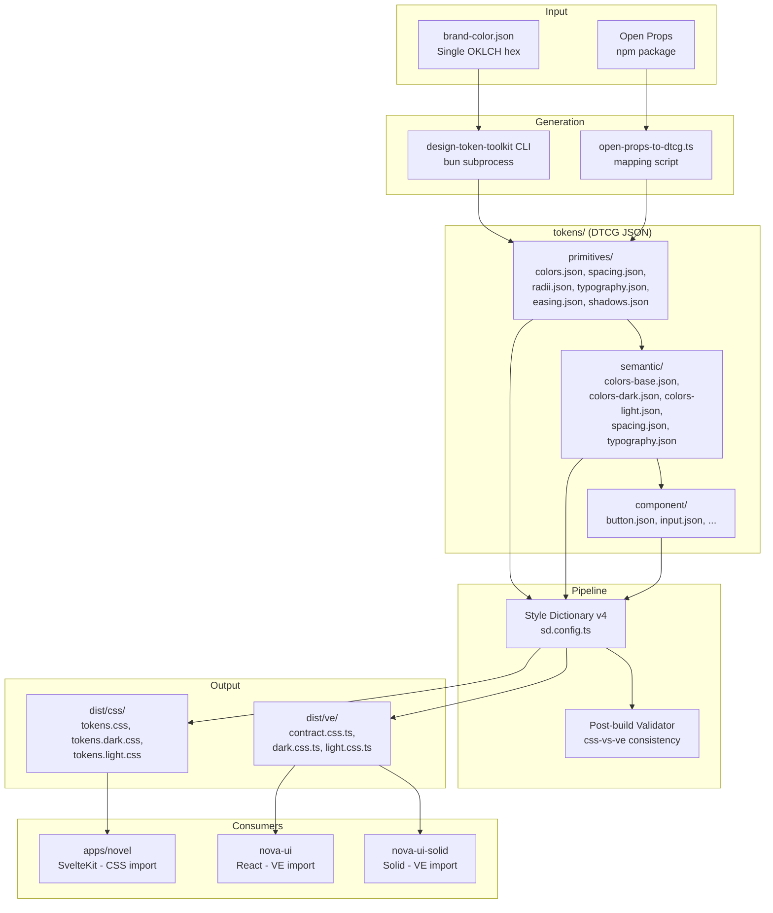

# Design Document: Design Token Integration

## Overview

This design integrates the `design-token-toolkit` OKLCH color generation engine into the `@cosmonexus/design-tokens` package via a Style Dictionary v4 pipeline. The goal is to replace hardcoded OKLCH values in vanilla-extract theme files with a generated, accessibility-verified token system that produces dual outputs: CSS custom properties (for the novel app and Svelte components) and vanilla-extract contracts (for React/Solid UI libraries).

The system introduces a three-layer DTCG token architecture (primitives → semantic → component), uses the toolkit CLI as a subprocess for palette generation, and relies on Style Dictionary v4's native DTCG support plus custom formats to produce both output targets from a single source of truth.

### Key Design Decisions

1. **Toolkit invocation**: CLI subprocess via `bun run` — keeps the toolkit as a separate repo with its own build, invoked during the `tokens:generate` script. No npm dependency or symlink required.
2. **Style Dictionary config**: Single `sd.config.ts` with multiple platforms (css-light, css-dark, vanilla-extract) — avoids config duplication while allowing per-theme source selection.
3. **DTCG file organization**: `tokens/` directory within `packages/design-tokens/` with `primitives/`, `semantic/`, and `component/` subdirectories.
4. **Custom SD formats**: A `vanilla-extract/contract` format and a `vanilla-extract/theme` format that emit valid `.css.ts` files.
5. **Open Props mapping**: A build-time script reads Open Props CSS and emits DTCG primitive JSON files (run once, version-controlled output).
6. **Regeneration workflow**: Single `bun run tokens:generate` command that orchestrates: toolkit CLI → DTCG assembly → Style Dictionary build → validation.
7. **CSS output for SvelteKit**: Static CSS files importable via `@cosmonexus/design-tokens/css` with `[data-theme]` selectors for theme switching — no Vite plugin needed.

## Architecture



### Data Flow

1. **Brand color input** → `brand-color.json` stores the single source hex value
2. **Toolkit CLI** → generates full OKLCH palette (primary shades 50-900, secondary, neutral, semantic status colors) with accessibility validation → writes `tokens/primitives/colors.json`
3. **Open Props script** → reads Open Props CSS, extracts spacing/radii/easing/shadow values → writes `tokens/primitives/spacing.json`, `radii.json`, etc.
4. **Semantic layer** → hand-authored DTCG JSON that aliases primitives (e.g., `{primitives.color.primary.500}`)
5. **Style Dictionary** → resolves aliases, applies transforms, runs custom formats → produces CSS and VE outputs
6. **Post-build validator** → compares token values across outputs, fails build on mismatch

## Components and Interfaces

### 1. Brand Color Configuration

**File**: `packages/design-tokens/brand-color.json`

```json
{
  "brandColor": "#8B5CF6",
  "hue": 295,
  "description": "Warm purple — primary accent for Cosmonexus"
}
```

### 2. Toolkit CLI Invocation (`scripts/generate-colors.ts`)

A Bun script that shells out to the toolkit CLI:

```typescript
import { $ } from 'bun'

const TOOLKIT_PATH = '../../design-token-toolkit'
const OUTPUT_PATH = './tokens/primitives/colors.json'

const brandConfig = await Bun.file('./brand-color.json').json()

// Invoke toolkit palette command with DTCG output format
await $`bun ${TOOLKIT_PATH}/dist/src/cli.js palette ${brandConfig.brandColor} \
  --format w3c \
  --output ${OUTPUT_PATH} \
  --namespace primitives.color`

// Verify accessibility
const generated = await Bun.file(OUTPUT_PATH).json()
console.log(`Generated ${Object.keys(generated).length} color primitives`)
```

**Interface contract**: The toolkit CLI accepts a hex color and `--format w3c` flag, outputting DTCG JSON with `$value` and `$type` properties. The `--namespace` flag wraps output in the correct nesting for the primitives layer.

### 3. Open Props Mapping Script (`scripts/open-props-to-dtcg.ts`)

Reads Open Props CSS custom properties and converts them to DTCG JSON:

```typescript
interface OpenPropsMapping {
  source: string          // Open Props CSS variable name
  target: string[]        // DTCG path segments
  type: string            // DTCG $type value
  transform?: (v: string) => string  // Optional value transformation
}

const MAPPINGS: OpenPropsMapping[] = [
  { source: '--size-1', target: ['primitives', 'space', '1'], type: 'dimension' },
  { source: '--size-2', target: ['primitives', 'space', '2'], type: 'dimension' },
  // ... spacing scale
  { source: '--radius-2', target: ['primitives', 'radius', 'sm'], type: 'dimension' },
  { source: '--radius-3', target: ['primitives', 'radius', 'md'], type: 'dimension' },
  // ... radii
  { source: '--ease-out-3', target: ['primitives', 'easing', 'out'], type: 'cubicBezier' },
  { source: '--ease-in-out-3', target: ['primitives', 'easing', 'inOut'], type: 'cubicBezier' },
  // ... easing
  { source: '--shadow-3', target: ['primitives', 'shadow', 'md'], type: 'shadow' },
  // ... shadows
]
```

This script runs once (or on Open Props version update) and commits the resulting DTCG JSON files. It is NOT part of the hot regeneration path.

### 4. Style Dictionary Configuration (`sd.config.ts`)

```typescript
import StyleDictionary from 'style-dictionary'
import { vanillaExtractContractFormat } from './sd-formats/ve-contract.ts'
import { vanillaExtractThemeFormat } from './sd-formats/ve-theme.ts'
import { cssVariablesFormat } from './sd-formats/css-variables.ts'

// Register custom formats
StyleDictionary.registerFormat(vanillaExtractContractFormat)
StyleDictionary.registerFormat(vanillaExtractThemeFormat)

const sharedSources = [
  'tokens/primitives/**/*.json',
  'tokens/semantic/colors-base.json',
  'tokens/semantic/spacing.json',
  'tokens/semantic/typography.json',
  'tokens/component/**/*.json',
]

export default {
  usesDtcg: true,
  source: [...sharedSources, 'tokens/semantic/colors-light.json'],
  platforms: {
    'css-light': {
      transformGroup: 'css',
      buildPath: 'dist/css/',
      prefix: 'cnx',
      files: [
        { destination: 'tokens.css', format: 'css/variables', options: { outputReferences: true } },
        { destination: 'tokens.light.css', format: 'css/variables', options: { outputReferences: true, selector: '[data-theme="light"]' } },
      ],
    },
    'css-dark': {
      transformGroup: 'css',
      buildPath: 'dist/css/',
      prefix: 'cnx',
      source: [...sharedSources, 'tokens/semantic/colors-dark.json'],
      files: [
        { destination: 'tokens.dark.css', format: 'css/variables', options: { outputReferences: true, selector: '[data-theme="dark"]' } },
      ],
    },
    've-contract': {
      transformGroup: 'js',
      buildPath: 'src/',
      files: [
        { destination: 'contract.css.ts', format: 'vanilla-extract/contract' },
      ],
    },
    've-dark': {
      transformGroup: 'js',
      buildPath: 'src/themes/',
      source: [...sharedSources, 'tokens/semantic/colors-dark.json'],
      files: [
        { destination: 'dark.css.ts', format: 'vanilla-extract/theme', options: { themeName: 'darkTheme' } },
      ],
    },
    've-light': {
      transformGroup: 'js',
      buildPath: 'src/themes/',
      source: [...sharedSources, 'tokens/semantic/colors-light.json'],
      files: [
        { destination: 'light.css.ts', format: 'vanilla-extract/theme', options: { themeName: 'lightTheme' } },
      ],
    },
  },
}
```

### 5. Custom Style Dictionary Formats

#### `vanilla-extract/contract` Format

Generates a `createThemeContract` call matching the current `tokens` export shape:

```typescript
// Output structure matches existing contract.css.ts
import { createThemeContract } from '@vanilla-extract/css'

export const tokens = createThemeContract({
  color: {
    surface0: null,
    surface1: null,
    // ... all color slots
  },
  font: { sans: null, mono: null },
  fontSize: { xs: null, sm: null, /* ... */ },
  // ... complete contract matching current shape
})
```

The format traverses the resolved token dictionary, building the nested object structure with `null` values for each leaf token.

#### `vanilla-extract/theme` Format

Generates a `createTheme` call with resolved values:

```typescript
import { createTheme } from '@vanilla-extract/css'
import { tokens } from '../contract.css'

export const darkTheme = createTheme(tokens, {
  color: {
    surface0: 'oklch(0.13 0.015 260)',
    // ... resolved values
  },
  // ... all categories
})
```

### 6. Post-Build Validator (`scripts/validate-outputs.ts`)

Compares CSS and VE outputs for consistency:

```typescript
interface ValidationResult {
  passed: boolean
  mismatches: Array<{
    tokenPath: string
    cssValue: string
    veValue: string
  }>
}
```

Parses the generated CSS file for custom property values and the VE theme file for string literals, then compares each token path. Exits non-zero on any mismatch.

### 7. Regeneration Script (`scripts/generate.ts`)

Orchestrates the full pipeline:

```typescript
// 1. Generate color primitives from brand color
await generateColors()

// 2. Run Style Dictionary build
await styleDictionaryBuild()

// 3. Validate output consistency
await validateOutputs()

// 4. Run tsup for final package build
await $`bun run build`
```

### 8. Package Export Map (updated `package.json`)

```json
{
  "exports": {
    ".": { "types": "./dist/index.d.ts", "import": "./dist/index.js" },
    "./contract": { "types": "./dist/contract.css.d.ts", "import": "./dist/contract.css.js" },
    "./themes/dark": { "types": "./dist/themes/dark.css.d.ts", "import": "./dist/themes/dark.css.js" },
    "./themes/light": { "types": "./dist/themes/light.css.d.ts", "import": "./dist/themes/light.css.js" },
    "./global": { "types": "./dist/global.css.d.ts", "import": "./dist/global.css.js" },
    "./css": "./dist/css/tokens.css",
    "./css/dark": "./dist/css/tokens.dark.css",
    "./css/light": "./dist/css/tokens.light.css"
  }
}
```

### 9. Novel App Integration

The novel app replaces its current vanilla-extract dependency with a plain CSS import:

```svelte
<!-- +layout.svelte -->
<script>
  import '@cosmonexus/design-tokens/css'
  import '@cosmonexus/design-tokens/css/dark'
</script>
```

Theme switching uses `document.documentElement.setAttribute('data-theme', 'dark')`. The vanilla-extract Vite plugin can be removed from the novel app's vite config.

## Data Models

### DTCG Token File Structure

#### Primitives Layer (`tokens/primitives/`)

**colors.json** (generated by toolkit CLI):
```json
{
  "$description": "Generated OKLCH color primitives from brand color",
  "primitives": {
    "color": {
      "primary": {
        "50":  { "$value": "oklch(0.97 0.02 295)", "$type": "color" },
        "100": { "$value": "oklch(0.93 0.04 295)", "$type": "color" },
        "200": { "$value": "oklch(0.87 0.08 295)", "$type": "color" },
        "300": { "$value": "oklch(0.80 0.12 295)", "$type": "color" },
        "400": { "$value": "oklch(0.72 0.16 295)", "$type": "color" },
        "500": { "$value": "oklch(0.63 0.18 295)", "$type": "color" },
        "600": { "$value": "oklch(0.55 0.20 295)", "$type": "color" },
        "700": { "$value": "oklch(0.45 0.22 295)", "$type": "color" },
        "800": { "$value": "oklch(0.35 0.20 295)", "$type": "color" },
        "900": { "$value": "oklch(0.25 0.16 295)", "$type": "color" }
      },
      "neutral": {
        "50":  { "$value": "oklch(0.97 0.005 260)", "$type": "color" },
        "900": { "$value": "oklch(0.13 0.015 260)", "$type": "color" }
      },
      "success": { "base": { "$value": "oklch(0.75 0.17 145)", "$type": "color" } },
      "error":   { "base": { "$value": "oklch(0.68 0.2 18)", "$type": "color" } },
      "warning": { "base": { "$value": "oklch(0.80 0.16 75)", "$type": "color" } }
    }
  }
}
```

**spacing.json** (generated from Open Props, version-controlled):
```json
{
  "$description": "Spacing primitives sourced from Open Props",
  "primitives": {
    "space": {
      "1":  { "$value": "0.25rem", "$type": "dimension" },
      "2":  { "$value": "0.5rem", "$type": "dimension" },
      "3":  { "$value": "0.75rem", "$type": "dimension" },
      "4":  { "$value": "1rem", "$type": "dimension" },
      "5":  { "$value": "1.25rem", "$type": "dimension" },
      "6":  { "$value": "1.5rem", "$type": "dimension" },
      "8":  { "$value": "2rem", "$type": "dimension" },
      "10": { "$value": "2.5rem", "$type": "dimension" }
    }
  }
}
```

**typography.json**:
```json
{
  "$description": "Typography primitives",
  "primitives": {
    "font": {
      "sans": { "$value": "'IBM Plex Sans', -apple-system, BlinkMacSystemFont, sans-serif", "$type": "fontFamily" },
      "mono": { "$value": "'IBM Plex Mono', ui-monospace, 'Cascadia Code', monospace", "$type": "fontFamily" }
    },
    "fontSize": {
      "xs":   { "$value": "0.75rem", "$type": "dimension" },
      "sm":   { "$value": "0.8125rem", "$type": "dimension" },
      "base": { "$value": "0.9375rem", "$type": "dimension" },
      "lg":   { "$value": "1.125rem", "$type": "dimension" },
      "xl":   { "$value": "1.375rem", "$type": "dimension" },
      "xxl":  { "$value": "1.75rem", "$type": "dimension" }
    },
    "fontWeight": {
      "medium":   { "$value": "500", "$type": "number" },
      "semibold": { "$value": "600", "$type": "number" },
      "bold":     { "$value": "700", "$type": "number" }
    },
    "lineHeight": {
      "tight":  { "$value": "1.25", "$type": "number" },
      "normal": { "$value": "1.5", "$type": "number" }
    }
  }
}
```

#### Semantic Layer (`tokens/semantic/`)

**colors-base.json** (shared semantic mappings):
```json
{
  "$description": "Semantic color tokens — shared between themes",
  "color": {
    "accent1": { "$value": "{primitives.color.primary.400}" },
    "accent2": { "$value": "{primitives.color.primary.300}" },
    "accent3": { "$value": "{primitives.color.primary.500}" },
    "success": { "$value": "{primitives.color.success.base}" },
    "error":   { "$value": "{primitives.color.error.base}" },
    "warning": { "$value": "{primitives.color.warning.base}" }
  }
}
```

**colors-dark.json** (dark theme surface/text overrides):
```json
{
  "$description": "Dark theme semantic color assignments",
  "color": {
    "surface0": { "$value": "{primitives.color.neutral.900}" },
    "surface1": { "$value": "{primitives.color.neutral.850}" },
    "surface2": { "$value": "{primitives.color.neutral.800}" },
    "surface3": { "$value": "{primitives.color.neutral.750}" },
    "surface4": { "$value": "{primitives.color.neutral.700}" },
    "text1":    { "$value": "{primitives.color.neutral.50}" },
    "text2":    { "$value": "{primitives.color.neutral.300}" },
    "text3":    { "$value": "{primitives.color.neutral.400}" },
    "accentBg": { "$value": "oklch(0.72 0.18 295 / 0.1)" },
    "successBg":     { "$value": "oklch(0.75 0.17 145 / 0.1)" },
    "errorBg":       { "$value": "oklch(0.68 0.2 18 / 0.1)" },
    "errorBorder":   { "$value": "oklch(0.68 0.2 18 / 0.3)" },
    "warningBg":     { "$value": "oklch(0.80 0.16 75 / 0.1)" },
    "warningBorder": { "$value": "oklch(0.80 0.16 75 / 0.3)" }
  }
}
```

**colors-light.json** (light theme overrides):
```json
{
  "$description": "Light theme semantic color assignments",
  "color": {
    "surface0": { "$value": "{primitives.color.neutral.50}" },
    "surface1": { "$value": "{primitives.color.neutral.100}" },
    "surface2": { "$value": "{primitives.color.neutral.150}" },
    "surface3": { "$value": "{primitives.color.neutral.200}" },
    "surface4": { "$value": "{primitives.color.neutral.250}" },
    "text1":    { "$value": "{primitives.color.neutral.900}" },
    "text2":    { "$value": "{primitives.color.neutral.600}" },
    "text3":    { "$value": "{primitives.color.neutral.500}" }
  }
}
```

**spacing.json** (semantic aliases):
```json
{
  "space": {
    "1":  { "$value": "{primitives.space.1}" },
    "2":  { "$value": "{primitives.space.2}" },
    "3":  { "$value": "{primitives.space.3}" },
    "4":  { "$value": "{primitives.space.4}" },
    "5":  { "$value": "{primitives.space.5}" },
    "6":  { "$value": "{primitives.space.6}" },
    "8":  { "$value": "{primitives.space.8}" },
    "10": { "$value": "{primitives.space.10}" }
  },
  "radius": {
    "sm":   { "$value": "{primitives.radius.sm}" },
    "md":   { "$value": "{primitives.radius.md}" },
    "lg":   { "$value": "{primitives.radius.lg}" },
    "full": { "$value": "{primitives.radius.full}" }
  }
}
```

#### Component Layer (`tokens/component/`)

Reserved for future use. Currently empty — semantic tokens map directly to the existing flat contract shape.

### File System Layout (Final State)

```
packages/design-tokens/
├── brand-color.json                  # Brand color configuration
├── sd.config.ts                      # Style Dictionary v4 config
├── scripts/
│   ├── generate.ts                   # Full pipeline orchestrator
│   ├── generate-colors.ts            # Toolkit CLI invocation
│   ├── open-props-to-dtcg.ts         # Open Props → DTCG conversion
│   └── validate-outputs.ts           # CSS vs VE consistency check
├── sd-formats/
│   ├── ve-contract.ts                # Custom SD format: createThemeContract
│   └── ve-theme.ts                   # Custom SD format: createTheme
├── tokens/
│   ├── primitives/
│   │   ├── colors.json               # Generated by toolkit CLI
│   │   ├── spacing.json              # From Open Props
│   │   ├── radii.json                # From Open Props
│   │   ├── typography.json           # IBM Plex + scale
│   │   ├── easing.json               # From Open Props
│   │   └── shadows.json              # From Open Props
│   ├── semantic/
│   │   ├── colors-base.json          # Shared semantic color aliases
│   │   ├── colors-dark.json          # Dark theme assignments
│   │   ├── colors-light.json         # Light theme assignments
│   │   ├── spacing.json              # Semantic spacing aliases
│   │   └── typography.json           # Semantic typography aliases
│   └── component/                    # Future: component-level tokens
├── src/
│   ├── contract.css.ts               # Generated by SD (VE contract)
│   ├── index.ts                      # Package entry (unchanged)
│   ├── global.css.ts                 # Global styles (unchanged)
│   └── themes/
│       ├── dark.css.ts               # Generated by SD (VE dark theme)
│       └── light.css.ts              # Generated by SD (VE light theme)
├── dist/
│   ├── css/
│   │   ├── tokens.css                # All semantic tokens as CSS vars (:root)
│   │   ├── tokens.dark.css           # Dark overrides ([data-theme="dark"])
│   │   └── tokens.light.css          # Light overrides ([data-theme="light"])
│   └── ... (tsup output for VE files)
└── package.json
```

## Correctness Properties

*A property is a characteristic or behavior that should hold true across all valid executions of a system — essentially, a formal statement about what the system should do. Properties serve as the bridge between human-readable specifications and machine-verifiable correctness guarantees.*

### Property 1: DTCG Round-Trip Consistency

*For any* valid DTCG token file in the source tree, parsing the JSON, serializing it back to JSON, and parsing again SHALL produce an equivalent token object (all `$value`, `$type`, and `$description` fields preserved).

**Validates: Requirements 1.6**

### Property 2: Deterministic Palette Generation

*For any* valid brand color hex string, invoking the palette generation function twice with the same input SHALL produce identical output arrays (same OKLCH values in the same order).

**Validates: Requirements 2.6**

### Property 3: DTCG Alias Resolution Completeness

*For any* token in the semantic or component layer that uses alias syntax (`{path.to.token}`), the referenced path SHALL resolve to an existing token in the primitives or semantic layer, and the resolved value SHALL be a valid string (not undefined or empty).

**Validates: Requirements 3.5, 3.7**

### Property 4: CSS-VE Value Equivalence

*For any* token in the semantic layer, the value emitted in the CSS output file and the value emitted in the vanilla-extract theme file SHALL be identical strings.

**Validates: Requirements 10.1, 10.5**

### Property 5: CSS Naming Convention Compliance

*For any* custom property in the CSS output, the property name SHALL match the pattern `--cnx-{category}-{name}` (lowercase, hyphen-separated, prefixed with `cnx`).

**Validates: Requirements 4.3**

### Property 6: Contract Shape Backward Compatibility

*For any* property path that exists in the current `tokens` contract export (all paths in `color`, `font`, `fontSize`, `fontWeight`, `lineHeight`, `space`, `radius`, `shadow`, `transition`, `easing`, `focusRing`, `borderSubtle`), the generated contract SHALL contain the same path.

**Validates: Requirements 5.2, 5.4, 9.5**

### Property 7: Theme Satisfies Contract

*For any* generated theme file (dark or light), every key path defined in the contract SHALL have a corresponding non-null string value in the theme implementation.

**Validates: Requirements 3.4, 5.3**

### Property 8: Accessibility Contrast Compliance

*For any* text color token and its corresponding surface color token within the same theme, the WCAG 2.1 contrast ratio SHALL be at least 4.5:1.

**Validates: Requirements 2.5, 6.2**

### Property 9: Open Props Value Type Preservation

*For any* spacing token sourced from Open Props, the resolved value SHALL be in rem units. *For any* radius token, the value SHALL be in px units. *For any* easing token, the value SHALL be a valid cubic-bezier string.

**Validates: Requirements 7.3**

### Property 10: OKLCH Color Format Consistency

*For any* color token in either the CSS or VE output, the value SHALL use OKLCH notation (matching the pattern `oklch(...)`).

**Validates: Requirements 10.2**

## Error Handling

### Build-Time Errors

| Error Condition | Behavior | Exit Code |
|---|---|---|
| Invalid brand color hex | Toolkit CLI reports format error, pipeline aborts | 1 |
| Broken DTCG alias reference | Style Dictionary reports path, pipeline aborts | 1 |
| Accessibility violation (contrast < 4.5:1) | Toolkit auto-adjusts lightness, logs warning | 0 (with warnings) |
| CSS/VE value mismatch | Validator reports divergent tokens, pipeline aborts | 1 |
| Missing toolkit CLI binary | Generate script reports missing path, aborts | 1 |
| Open Props import failure | Script reports missing package, aborts | 1 |
| Invalid DTCG JSON schema | Style Dictionary parser reports location, aborts | 1 |

### Runtime Errors

- **Missing CSS file at import**: The `./css` export path is validated at build time via the export map. If the file is missing post-build, consumers get a standard module resolution error.
- **Contract type mismatch**: VE consumers get compile-time TypeScript errors if the contract shape changes unexpectedly.
- **Theme switching with missing CSS**: If only `tokens.css` is loaded without a theme-specific file, the `:root` values apply as fallback (light theme by default).

### Warning Conditions

- Accessibility auto-adjustment: When a generated color is adjusted for contrast compliance, the pipeline logs the original value, the adjusted value, and the contrast ratio before/after.
- Unused primitives: If a primitive token is defined but not referenced by any semantic token, the validator logs a warning (non-blocking).

## Testing Strategy

### Unit Tests (Vitest)

- **DTCG parsing**: Verify JSON files conform to DTCG schema (have `$value`, `$type` on leaf nodes)
- **Open Props mapping**: Verify specific Open Props values map to correct DTCG paths and types
- **SD format output**: Verify custom formats produce syntactically valid TypeScript
- **Alias resolution**: Verify specific alias chains resolve correctly
- **CSS naming**: Verify prefix and casing rules on sample outputs
- **Export map**: Verify all documented export paths resolve

### Property-Based Tests (fast-check + Vitest)

The project already uses `fast-check` 3.23.2 and `vitest` 2.1.8 at the workspace root.

- **Property 1**: Generate arbitrary DTCG-shaped JSON objects, verify round-trip parse/serialize/parse equivalence
- **Property 2**: Generate arbitrary valid hex colors, run palette generation twice, assert deep equality
- **Property 3**: Generate token dictionaries with alias references, verify all resolve without error
- **Property 4**: After build, parse both CSS and VE outputs, compare every token path's value
- **Property 5**: Generate arbitrary token names, verify CSS output naming matches `--cnx-*` pattern
- **Property 6**: Compare generated contract paths against snapshot of current contract
- **Property 7**: Verify every contract key has a value in each theme file
- **Property 8**: Generate color pairs (text on surface), compute OKLCH contrast, verify ≥ 4.5:1
- **Property 9**: Generate Open Props dimension values, verify unit preservation after pipeline
- **Property 10**: Generate arbitrary OKLCH color strings, verify format in output

Property tests run with minimum 100 iterations each.

**Tag format**: `Feature: design-token-integration, Property {N}: {description}`

### Integration Tests

- **Full pipeline run**: Execute `tokens:generate` end-to-end, verify all output files exist and are non-empty
- **Novel app import**: Verify CSS file is importable and contains expected custom properties
- **VE consumer compile**: Verify `nova-ui` can import the generated contract without TypeScript errors
- **Brand color change**: Change brand hex, regenerate, verify all outputs reflect new hue

### Smoke Tests

- **Toolkit CLI availability**: Verify the toolkit binary exists and responds to `--help`
- **Style Dictionary version**: Verify SD v4 is available with DTCG support enabled
- **Package exports**: Verify each export path resolves after build
