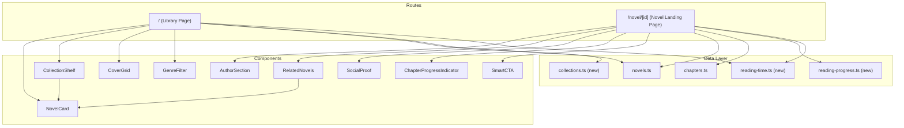

# Design Document: Novel Landing Pages

## Overview

This design expands the novel app's two reader-facing pages — the Library (`/`) and the Novel Landing (`/novel/[id]`) — from their current minimal state into a full editorial discovery experience. The approach adds collection shelves, genre filtering, reading progress tracking, author sections, related novels, and responsive cover grids while staying within the existing SvelteKit + localStorage architecture.

The data layer remains unchanged: all novels and chapters live in localStorage with the existing `cosmonexus:` prefix. New state (reading progress, collection definitions) is added as new localStorage entries through the existing `storage.ts` abstraction. No server routes are needed.

The design language is editorial/literary — serif reading fonts, display headings, generous whitespace, measure-based widths, minimal chrome. All styling uses the acaldwell-dev token system with modern CSS (OKLCH colors, logical properties, container queries, `focus-visible`).

## Architecture

### High-Level Structure



### Data Flow

All data flows are synchronous reads from localStorage via the existing `storage.ts` abstraction. There are no server loads or async data fetching. The app seeds 6 novels on first visit, and all subsequent operations are client-side reads/writes.

- **Library Page**: calls `listNovels()` → derives featured novel, filters by genre, computes collections, computes reading times
- **Novel Landing Page**: calls `getNovel(id)` → derives statistics, reading progress, related novels, smart CTA state

## Components and Interfaces

### New Reusable Components

| Component | Location | Props | Responsibility |
|-----------|----------|-------|----------------|
| `NovelCard` | `src/lib/components/NovelCard.svelte` | `novel: NovelMeta`, `size?: 'sm' | 'md' | 'lg'` | Cover thumbnail + title + author + reading time. Used in shelves, grids, and related novels. |
| `CollectionShelf` | `src/lib/components/CollectionShelf.svelte` | `title: string`, `novels: NovelMeta[]` | Labeled horizontal scrollable row of NovelCards. |
| `CoverGrid` | `src/lib/components/CoverGrid.svelte` | `novels: NovelMeta[]` | Responsive grid of cover images. 2-col mobile, 3-5 col desktop. |
| `GenreFilter` | `src/lib/components/GenreFilter.svelte` | `genres: string[]`, `selected: string | null`, `onSelect: (genre: string | null) => void` | Horizontal row of genre chips with active state. |
| `AuthorSection` | `src/lib/components/AuthorSection.svelte` | `author: string`, `novelId: string` | Author name, circular avatar placeholder, bio text. |
| `RelatedNovels` | `src/lib/components/RelatedNovels.svelte` | `currentNovel: NovelMeta`, `allNovels: NovelMeta[]` | Up to 4 related novels by genre, with fallback. |
| `SocialProof` | `src/lib/components/SocialProof.svelte` | `novelId: string` | Static placeholder: star rating, reader count, review count. |
| `ChapterProgressIndicator` | `src/lib/components/ChapterProgressIndicator.svelte` | `read: boolean` | Small dot/icon indicating read/unread state. |
| `SmartCTA` | `src/lib/components/SmartCTA.svelte` | `novel: NovelMeta`, `progress: ReadingProgress | null` | Button that adapts label: Start Reading / Continue Reading / Read Again. |

### New Data Modules

| Module | Location | Exports |
|--------|----------|---------|
| `reading-progress.ts` | `src/lib/data/reading-progress.ts` | `getProgress(novelId)`, `markChapterRead(novelId, chapterId)`, `getNextUnread(novel, progress)` |
| `collections.ts` | `src/lib/data/collections.ts` | `getStaffPicks(novels)`, `getCompletedSeries(novels)`, `getRisingAuthors(novels)`, `getNewThisWeek(novels)` |
| `reading-time.ts` | `src/lib/data/reading-time.ts` | `formatReadingTime(wordCount)`, `getPublishedWordCount(novel)`, `computeUpdateFrequency(novel)` |

### New State

No new Svelte stores are introduced. Genre filter state is managed locally within the Library page component via `$state`. Reading progress is persisted to localStorage through the data module and read reactively on page mount.

**Rationale**: The genre filter is page-local (no other component needs it), and reading progress is persisted (survives page navigation already). A store adds complexity without benefit here.

## Data Models

### Reading Progress (localStorage)

```typescript
/** Stored at key: `cosmonexus:reading-progress:{novelId}` */
type ReadingProgress = {
  novelId: string
  /** Map of chapterId → timestamp when first viewed */
  chaptersRead: Record<string, string>
  /** Last chapter the reader navigated to */
  lastChapterId: string | null
  updatedAt: string
}
```

**Storage key pattern**: `reading-progress:{novelId}`

This is intentionally simple — a flat record per novel. No arrays to sort through, O(1) lookup for "has chapter been read", and trivial to persist/update.

### Collection Shelf Definitions

Collections are computed algorithmically from the novel list at render time (no separate storage). Logic:

| Collection | Algorithm |
|------------|-----------|
| **New This Week** | Novels where `updatedAt` is within the last 7 days, sorted by `updatedAt` desc |
| **Staff Picks** | First 4 novels sorted by total published word count desc (proxy for editorial quality in seed data) |
| **Completed Series** | Novels where every chapter has `status === 'final'` |
| **Rising Authors** | Authors with novels that have more `draft` or `revision` chapters than `final` (actively writing) |

### Author Bio Data (Static)

For the MVP, author bios are a static map keyed by author name:

```typescript
const AUTHOR_BIOS: Record<string, string> = {
  'A. Caldwell': 'Writes speculative fiction exploring humanity...',
  'M. Torres': 'Fantasy novelist drawn to stories about...',
  // ...
}
```

This lives in a `src/lib/data/authors.ts` module. No new type export needed — it's a simple string lookup.

### Social Proof Data (Static Mock)

```typescript
/** Static placeholder data for the social proof section. */
const MOCK_SOCIAL: Record<string, { rating: number; readers: number; reviews: number }> = {
  'demo-last-horizon': { rating: 4.5, readers: 2847, reviews: 42 },
  // ...
}
```

This is inline in the `SocialProof` component since it's throwaway mock data that will be replaced by real data later.

### Genre Filter State

```typescript
// Inside +page.svelte
let selectedGenre = $state<string | null>(null)
const availableGenres = $derived(
  [...new Set(novels.map(n => n.genre).filter(Boolean))]
)
const filteredNovels = $derived(
  selectedGenre ? novels.filter(n => n.genre === selectedGenre) : novels
)
```

**Decision: local state vs URL params vs store**

Local `$state` is chosen because:
1. Genre filter is not shareable (no auth, no bookmarkable filtered views needed)
2. Reader expects filter to reset on page reload (ephemeral state)
3. Simplest implementation, no routing changes needed

### Reading Time Utility

```typescript
const WPM = 250

/** Format a word count as human-readable reading time. */
export function formatReadingTime(wordCount: number): string {
  const minutes = Math.ceil(wordCount / WPM)
  if (minutes < 60) return `${minutes} min`
  const hours = Math.floor(minutes / 60)
  const remaining = minutes % 60
  if (remaining === 0) return `${hours} hr`
  return `${hours} hr ${remaining} min`
}

/** Get total word count from published chapters only (final + editing). */
export function getPublishedWordCount(novel: NovelMeta): number {
  return novel.chapters
    .filter(ch => ch.status === 'final' || ch.status === 'editing')
    .reduce((sum, ch) => sum + ch.wordCount, 0)
}

/** Compute update frequency from chapter timestamps. */
export function computeUpdateFrequency(novel: NovelMeta): string | null {
  const published = novel.chapters
    .filter(ch => ch.status === 'final' || ch.status === 'editing')
  if (published.length < 2) return null
  
  const timestamps = published.map(ch => new Date(ch.updatedAt).getTime()).sort()
  const intervals = timestamps.slice(1).map((t, i) => t - timestamps[i])
  const avgInterval = intervals.reduce((a, b) => a + b, 0) / intervals.length
  const days = avgInterval / (1000 * 60 * 60 * 24)
  
  if (days <= 7) return 'Updated weekly'
  if (days <= 14) return 'Updated biweekly'
  if (days <= 35) return 'Updated monthly'
  return 'Updated occasionally'
}
```

### Smart CTA Logic

```typescript
export function getSmartCTAState(
  novel: NovelMeta,
  progress: ReadingProgress | null
): { label: string; targetChapterOrder: number } {
  const published = novel.chapters
    .filter(ch => ch.status === 'final' || ch.status === 'editing')
    .sort((a, b) => a.order - b.order)

  if (!published.length) return { label: 'Start Reading', targetChapterOrder: 1 }

  if (!progress || Object.keys(progress.chaptersRead).length === 0) {
    return { label: 'Start Reading', targetChapterOrder: published[0].order }
  }

  const allRead = published.every(ch => progress.chaptersRead[ch.id])
  if (allRead) {
    return { label: 'Read Again', targetChapterOrder: published[0].order }
  }

  const nextUnread = published.find(ch => !progress.chaptersRead[ch.id])
  return {
    label: 'Continue Reading',
    targetChapterOrder: nextUnread?.order ?? published[0].order
  }
}
```

### Related Novels Algorithm

```typescript
export function getRelatedNovels(
  current: NovelMeta,
  allNovels: NovelMeta[]
): NovelMeta[] {
  const others = allNovels.filter(n => n.id !== current.id)
  
  // Priority 1: same genre
  const sameGenre = others.filter(n => n.genre === current.genre)
  
  if (sameGenre.length >= 4) return sameGenre.slice(0, 4)
  
  // Priority 2: supplement with same author
  const sameAuthor = others.filter(
    n => n.author === current.author && n.genre !== current.genre
  )
  const combined = [...sameGenre, ...sameAuthor]
  
  if (combined.length >= 2) return combined.slice(0, 4)
  
  // Priority 3: fill from other genres
  const remaining = others.filter(
    n => n.genre !== current.genre && n.author !== current.author
  )
  return [...combined, ...remaining].slice(0, 4)
}
```

## Correctness Properties

*A property is a characteristic or behavior that should hold true across all valid executions of a system — essentially, a formal statement about what the system should do. Properties serve as the bridge between human-readable specifications and machine-verifiable correctness guarantees.*

### Property 1: Reading time round-trip consistency

*For any* non-negative integer word count, `formatReadingTime(wordCount)` SHALL produce a string that, when parsed back into minutes, is within ±1 minute of `Math.ceil(wordCount / 250)`.

**Validates: Requirements 5.3**

### Property 2: Published word count only includes qualifying chapters

*For any* novel with chapters of mixed statuses, `getPublishedWordCount(novel)` SHALL equal the sum of `wordCount` values from chapters whose status is `'final'` or `'editing'`, and SHALL exclude chapters with status `'draft'` or `'revision'`.

**Validates: Requirements 5.3, 8.1**

### Property 3: Genre filter is a pure subset

*For any* set of novels and any selected genre string, the filtered result SHALL be a subset of the original list where every novel has `genre === selectedGenre`, and the unfiltered list SHALL equal the original list.

**Validates: Requirements 3.2, 3.3**

### Property 4: Smart CTA state is exhaustive and deterministic

*For any* novel with at least one published chapter and any reading progress record, `getSmartCTAState` SHALL return exactly one of `"Start Reading"`, `"Continue Reading"`, or `"Read Again"` — where `"Start Reading"` is returned when no chapters are read, `"Read Again"` when all published chapters are read, and `"Continue Reading"` otherwise.

**Validates: Requirements 13.1, 13.2, 13.3**

### Property 5: Related novels exclusion invariant

*For any* novel and list of all novels, `getRelatedNovels(current, allNovels)` SHALL never include the current novel in its result, and SHALL return at most 4 novels.

**Validates: Requirements 10.1, 10.2**

### Property 6: Related novels minimum guarantee

*For any* novel where the total catalog contains at least 3 novels (including the current one), `getRelatedNovels` SHALL return at least 2 novels.

**Validates: Requirements 10.3**

### Property 7: Collection "Completed Series" correctness

*For any* novel list, `getCompletedSeries(novels)` SHALL return only novels where every chapter has `status === 'final'`, and SHALL never include a novel that has any chapter with a non-final status.

**Validates: Requirements 4.1**

### Property 8: New This Week recency bound

*For any* novel list and current timestamp, `getNewThisWeek(novels)` SHALL return only novels whose `updatedAt` timestamp is within 7 days of the current time, ordered by `updatedAt` descending.

**Validates: Requirements 2.1**

### Property 9: Reading progress idempotence

*For any* novel and chapter, calling `markChapterRead(novelId, chapterId)` multiple times SHALL produce the same `ReadingProgress` state as calling it once — the `chaptersRead` entry is set on first call and subsequent calls do not alter the original timestamp.

**Validates: Requirements 11.2, 13.4**

### Property 10: Update frequency requires minimum chapters

*For any* novel with fewer than 2 published chapters, `computeUpdateFrequency(novel)` SHALL return `null`.

**Validates: Requirements 8.3**

## Error Handling

This feature operates entirely on local data with no network calls or async operations, so error scenarios are limited:

| Scenario | Handling |
|----------|----------|
| Novel not found (`getNovel` returns null) | Novel Landing Page renders a "not found" message with link back to library. Already implemented. |
| Empty novel list | Library Page renders empty state with link to author page. Already implemented. |
| Corrupt localStorage (parse error) | The existing `storage.get()` catches JSON parse errors and returns `null`. Components treat null as empty/absent. |
| Missing `coverUrl` on a novel | All cover components already render a placeholder (first letter of title). Extended to new components. |
| No published chapters on a novel | Smart CTA still renders "Start Reading" pointed at order 1. Stats section omits update frequency. Chapter list shows "No published chapters yet." |
| Reading progress key missing | Treated as no progress — Smart CTA shows "Start Reading", all chapter indicators show unread. |

No error boundaries or toast notifications are needed for this feature — all failure modes degrade gracefully to existing UI patterns.

## Testing Strategy

### Unit Tests

Unit tests (using Vitest) cover the pure utility functions:

- `reading-time.ts`: specific examples for 0 words, 249 words, 250 words, 15000 words, edge formatting
- `collections.ts`: specific examples with known seed data configurations
- `reading-progress.ts`: CRUD operations, edge cases (marking already-read chapter)
- `getSmartCTAState`: concrete scenarios for each of the 3 states
- `getRelatedNovels`: concrete scenarios with known genre/author combinations
- `computeUpdateFrequency`: specific timestamp patterns for each label

### Property-Based Tests

Property-based tests use [fast-check](https://github.com/dubzzz/fast-check) with minimum 100 iterations per property:

- **Feature: novel-landing-pages, Property 1**: Reading time formatting consistency
- **Feature: novel-landing-pages, Property 2**: Published word count chapter status filtering
- **Feature: novel-landing-pages, Property 3**: Genre filter pure subset
- **Feature: novel-landing-pages, Property 4**: Smart CTA exhaustive states
- **Feature: novel-landing-pages, Property 5**: Related novels exclusion invariant
- **Feature: novel-landing-pages, Property 6**: Related novels minimum guarantee
- **Feature: novel-landing-pages, Property 7**: Completed Series correctness
- **Feature: novel-landing-pages, Property 8**: New This Week recency bound
- **Feature: novel-landing-pages, Property 9**: Reading progress idempotence
- **Feature: novel-landing-pages, Property 10**: Update frequency minimum chapters

Each test is tagged with a comment: `// Feature: novel-landing-pages, Property N: <property text>`

### Component Tests

Svelte component tests (using `@testing-library/svelte` + Vitest) for:

- `GenreFilter`: renders all genres, fires onSelect, shows active state
- `SmartCTA`: renders correct label based on progress state
- `CoverGrid`: renders correct number of grid items
- `NovelCard`: renders title, author, reading time

### Accessibility Testing

- Heading hierarchy validation (no skipped levels)
- `aria-pressed` on genre filter chips
- Keyboard navigation through all interactive elements
- `alt` text on cover images

### What Is NOT Property-Tested

- CSS layout and responsive behavior (visual regression territory)
- Collection shelf horizontal scrolling (browser behavior)
- Transitions and animations (visual, `prefers-reduced-motion` tested manually)
- Social proof static mock rendering (trivial, example-based test)
- Author section bio lookup (simple map access, example-based test)
