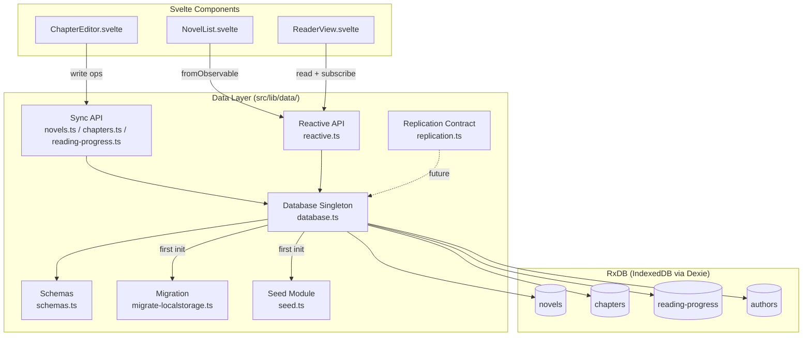
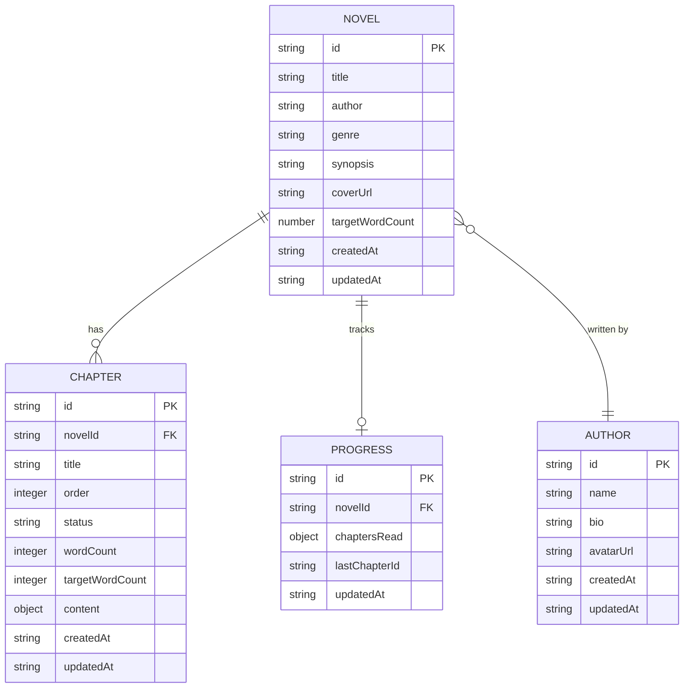

# Design Document: RxDB Integration

## Overview

This design replaces the novel app's localStorage-based data layer (`src/lib/data/`) with RxDB backed by Dexie.js (IndexedDB). The migration introduces:

- A lazily-created singleton RxDB database with typed collections
- Chapters stored as a separate collection (not nested in novels) for independent querying and lazy content loading
- Reactive queries via RxJS Observables, consumed in Svelte 5 components through the existing `fromObservable` utility
- An async initialization pattern that keeps the existing synchronous API surface functional via cached reactive state
- A one-time localStorage-to-RxDB migration for existing users
- A replication contract stub for future server sync

The public API of `novels.ts`, `chapters.ts`, and `reading-progress.ts` remains unchanged — consumers don't need modification.

## Architecture



### Design Decisions

1. **Singleton via lazy `getDatabase()`**: The database is created once on first call, cached as a module-level promise. This avoids initialization during SSR (the app uses `ssr=false` globally).

2. **Cached reactive state for sync API compatibility**: Since RxDB is async but the current API is sync, we maintain an in-memory cache populated by reactive subscriptions. Sync functions read from this cache (returning stale-until-first-emission data). Reactive observables provide the live truth.

3. **Separate chapters collection**: Chapters are stored independently with a `novelId` foreign key. Novel documents no longer embed chapter arrays. This prevents large ProseMirror content from bloating novel list queries and enables lazy content loading.

4. **`reactive.ts` as the reactive surface**: All `$`-suffixed observable functions live in a single module, returning RxJS Observables that components consume via `fromObservable(obs$, initialValue)`.

5. **One-time localStorage migration**: On first RxDB init, if localStorage contains existing data, it's bulk-inserted into RxDB collections and localStorage is cleared. This runs before seeding.

## Components and Interfaces

### `database.ts` — Database Singleton

```typescript
import { createRxDatabase, type RxDatabase } from 'rxdb/plugins/core'
import { getRxStorageDexie } from 'rxdb/plugins/storage-dexie'
import { addRxPlugin } from 'rxdb'
import { RxDBMigrationSchemaPlugin } from 'rxdb/plugins/migration-schema'
import type { NovelCollection, ChapterCollection, ProgressCollection, AuthorCollection } from './schemas'

export type AppDatabase = RxDatabase<{
  novels: NovelCollection
  chapters: ChapterCollection
  progress: ProgressCollection
  authors: AuthorCollection
}>

let dbPromise: Promise<AppDatabase> | null = null

/**
 * Returns the singleton RxDB instance. Creates it lazily on first call.
 * Throws if called in a non-browser environment.
 */
export async function getDatabase(): Promise<AppDatabase> {
  if (typeof window === 'undefined') {
    throw new Error('[data] RxDB cannot be initialized outside the browser.')
  }
  if (!dbPromise) {
    dbPromise = initDatabase()
  }
  return dbPromise
}

async function initDatabase(): Promise<AppDatabase> {
  addRxPlugin(RxDBMigrationSchemaPlugin)

  const db = await createRxDatabase<AppDatabase>({
    name: 'cosmonexus-novel',
    storage: getRxStorageDexie(),
    multiInstance: true,
    eventReduce: true,
  })

  await db.addCollections({
    novels: { schema: novelSchema, migrationStrategies: {} },
    chapters: { schema: chapterSchema, migrationStrategies: {} },
    progress: { schema: progressSchema, migrationStrategies: {} },
    authors: { schema: authorSchema, migrationStrategies: {} },
  })

  // Migrate from localStorage if data exists there
  await migrateFromLocalStorage(db)

  // Seed if empty
  await seedIfEmpty(db)

  return db
}
```

### `schemas.ts` — Collection Schemas & Types

```typescript
import type { RxCollection, RxDocument, RxJsonSchema } from 'rxdb'

// --- Novel ---
export type NovelDocType = {
  id: string
  title: string
  author: string
  genre?: string
  synopsis?: string
  coverUrl?: string
  targetWordCount?: number
  createdAt: string
  updatedAt: string
}

export type NovelDocument = RxDocument<NovelDocType>
export type NovelCollection = RxCollection<NovelDocType>

export const novelSchema: RxJsonSchema<NovelDocType> = {
  version: 0,
  primaryKey: 'id',
  type: 'object',
  properties: {
    id: { type: 'string', maxLength: 100 },
    title: { type: 'string' },
    author: { type: 'string', maxLength: 200 },
    genre: { type: 'string', maxLength: 100 },
    synopsis: { type: 'string' },
    coverUrl: { type: 'string' },
    targetWordCount: { type: 'number' },
    createdAt: { type: 'string', format: 'date-time', maxLength: 30 },
    updatedAt: { type: 'string', format: 'date-time', maxLength: 30 },
  },
  required: ['id', 'title', 'author', 'createdAt', 'updatedAt'],
  indexes: [
    ['genre'],
    ['author'],
    ['updatedAt'],
  ],
}

// --- Chapter ---
export type ChapterDocType = {
  id: string
  novelId: string
  title: string
  order: number
  status: 'draft' | 'revision' | 'editing' | 'final'
  wordCount: number
  targetWordCount?: number
  content?: DocumentJSON // stored inline but only loaded on demand
  createdAt: string
  updatedAt: string
}

export type ChapterDocument = RxDocument<ChapterDocType>
export type ChapterCollection = RxCollection<ChapterDocType>

export const chapterSchema: RxJsonSchema<ChapterDocType> = {
  version: 0,
  primaryKey: 'id',
  type: 'object',
  properties: {
    id: { type: 'string', maxLength: 100 },
    novelId: { type: 'string', maxLength: 100 },
    title: { type: 'string' },
    order: { type: 'integer', minimum: 0, maximum: 10000, multipleOf: 1 },
    status: { type: 'string', maxLength: 20 },
    wordCount: { type: 'integer', minimum: 0, maximum: 10000000, multipleOf: 1 },
    targetWordCount: { type: 'integer', minimum: 0, maximum: 10000000, multipleOf: 1 },
    content: { type: 'object' },
    createdAt: { type: 'string', format: 'date-time', maxLength: 30 },
    updatedAt: { type: 'string', format: 'date-time', maxLength: 30 },
  },
  required: ['id', 'novelId', 'title', 'order', 'status', 'wordCount', 'createdAt', 'updatedAt'],
  indexes: [
    ['novelId', 'order'],
    ['novelId', 'status'],
    ['status'],
  ],
}

// --- Reading Progress ---
export type ProgressDocType = {
  id: string
  novelId: string
  chaptersRead: Record<string, string> // chapterId → ISO timestamp
  lastChapterId?: string
  updatedAt: string
}

export type ProgressDocument = RxDocument<ProgressDocType>
export type ProgressCollection = RxCollection<ProgressDocType>

export const progressSchema: RxJsonSchema<ProgressDocType> = {
  version: 0,
  primaryKey: 'id',
  type: 'object',
  properties: {
    id: { type: 'string', maxLength: 100 },
    novelId: { type: 'string', maxLength: 100 },
    chaptersRead: { type: 'object' },
    lastChapterId: { type: 'string', maxLength: 100 },
    updatedAt: { type: 'string', format: 'date-time', maxLength: 30 },
  },
  required: ['id', 'novelId', 'chaptersRead', 'updatedAt'],
  indexes: [
    ['novelId'],
  ],
}

// --- Author ---
export type AuthorDocType = {
  id: string
  name: string
  bio?: string
  avatarUrl?: string
  createdAt: string
  updatedAt: string
}

export type AuthorDocument = RxDocument<AuthorDocType>
export type AuthorCollection = RxCollection<AuthorDocType>

export const authorSchema: RxJsonSchema<AuthorDocType> = {
  version: 0,
  primaryKey: 'id',
  type: 'object',
  properties: {
    id: { type: 'string', maxLength: 100 },
    name: { type: 'string', maxLength: 200 },
    bio: { type: 'string' },
    avatarUrl: { type: 'string' },
    createdAt: { type: 'string', format: 'date-time', maxLength: 30 },
    updatedAt: { type: 'string', format: 'date-time', maxLength: 30 },
  },
  required: ['id', 'name', 'createdAt', 'updatedAt'],
  indexes: [
    ['name'],
  ],
}
```

### `reactive.ts` — Reactive Query Surface

```typescript
import { type Observable } from 'rxjs'
import { map, shareReplay, switchMap } from 'rxjs/operators'
import { from } from 'rxjs'
import type { NovelMeta, ChapterMeta } from '@cosmonexus/nova-types'
import type { ReadingProgress } from './reading-progress'
import { getDatabase } from './database'

/**
 * Helper: lazily get a collection observable once DB is ready.
 */
function fromDb<T>(factory: (db: AppDatabase) => Observable<T>): Observable<T> {
  return from(getDatabase()).pipe(switchMap(factory), shareReplay(1))
}

/** Observable of all novels, re-emits on any change. */
export function novels$(): Observable<NovelMeta[]> {
  return fromDb(db =>
    db.novels.find().$.pipe(
      map(docs => docs.map(toNovelMeta))
    )
  )
}

/** Observable of a single novel by id. */
export function novel$(id: string): Observable<NovelMeta | null> {
  return fromDb(db =>
    db.novels.findOne(id).$.pipe(
      map(doc => doc ? toNovelMeta(doc) : null)
    )
  )
}

/** Observable of chapters for a novel, ordered by `order`. */
export function chapters$(novelId: string): Observable<ChapterMeta[]> {
  return fromDb(db =>
    db.chapters.find({ selector: { novelId }, sort: [{ order: 'asc' }] }).$.pipe(
      map(docs => docs.map(toChapterMeta))
    )
  )
}

/** Observable of reading progress for a novel. */
export function progress$(novelId: string): Observable<ReadingProgress | null> {
  return fromDb(db =>
    db.progress.findOne({ selector: { novelId } }).$.pipe(
      map(doc => doc ? toProgress(doc) : null)
    )
  )
}
```

### `novels.ts` — Migrated CRUD (sync + async)

The sync functions read from an internal cache primed by a background subscription. The cache is populated on first `getDatabase()` resolution. Before the DB is ready, sync functions return empty/null — the reactive layer handles freshness.

```typescript
import type { NovelMeta } from '@cosmonexus/nova-types'
import { getDatabase } from './database'
import { uid } from './utils'

// --- Internal cache (populated by subscription in init) ---
let _novelsCache: NovelMeta[] = []

export function _primeCache(novels: NovelMeta[]): void {
  _novelsCache = novels
}

/** Get all novels (metadata only). */
export function listNovels(): NovelMeta[] {
  return _novelsCache
}

/** Get a single novel by ID. */
export function getNovel(id: string): NovelMeta | null {
  return _novelsCache.find(n => n.id === id) ?? null
}

/** Create a new novel. Returns the created novel. */
export async function createNovel(data: {
  title: string; author: string; genre?: string; synopsis?: string; targetWordCount?: number
}): Promise<NovelMeta> {
  const db = await getDatabase()
  const now = new Date().toISOString()
  const doc = await db.novels.insert({
    id: uid(),
    title: data.title,
    author: data.author,
    genre: data.genre,
    synopsis: data.synopsis,
    targetWordCount: data.targetWordCount,
    createdAt: now,
    updatedAt: now,
  })
  return toNovelMeta(doc)
}

/** Update a novel's metadata. */
export async function updateNovel(
  id: string, updates: Partial<Omit<NovelMeta, 'id' | 'createdAt' | 'chapters'>>
): Promise<NovelMeta | null> {
  const db = await getDatabase()
  const doc = await db.novels.findOne(id).exec()
  if (!doc) return null
  const patched = await doc.incrementalPatch({
    ...updates,
    updatedAt: new Date().toISOString(),
  })
  return toNovelMeta(patched)
}

/** Delete a novel and all its chapter content. */
export async function deleteNovel(id: string): Promise<void> {
  const db = await getDatabase()
  // Remove all chapters for this novel
  const chapters = await db.chapters.find({ selector: { novelId: id } }).exec()
  await Promise.all(chapters.map(ch => ch.remove()))
  // Remove the novel
  const novel = await db.novels.findOne(id).exec()
  if (novel) await novel.remove()
}

/** Get total word count for a novel. */
export async function getNovelWordCount(id: string): Promise<number> {
  const db = await getDatabase()
  const chapters = await db.chapters.find({ selector: { novelId: id } }).exec()
  return chapters.reduce((sum, ch) => sum + ch.wordCount, 0)
}
```

**Note on API stability**: Functions that were previously synchronous (`listNovels`, `getNovel`) remain synchronous by reading from cache. Write operations (`createNovel`, `updateNovel`, `deleteNovel`) become async (return Promise). Since callers already handle these in event handlers/actions, this is non-breaking. The reactive observables are the recommended path for reading live data.

### `chapters.ts` — Migrated CRUD

Same pattern: sync reads from cache, async writes via RxDB. `getChapterContent` is explicitly async because it loads the potentially-large `content` field.

```typescript
/** Get chapter document content (the ProseMirror JSON). */
export async function getChapterContent(novelId: string, chapterId: string): Promise<DocumentJSON | null> {
  const db = await getDatabase()
  const doc = await db.chapters.findOne(chapterId).exec()
  if (!doc || doc.novelId !== novelId) return null
  return (doc.content as DocumentJSON) ?? null
}

/** Save chapter content and update word count. */
export async function saveChapterContent(
  novelId: string, chapterId: string, content: DocumentJSON, wordCount: number
): Promise<void> {
  const db = await getDatabase()
  const doc = await db.chapters.findOne(chapterId).exec()
  if (!doc || doc.novelId !== novelId) return
  await doc.incrementalPatch({
    content,
    wordCount,
    updatedAt: new Date().toISOString(),
  })
}

/** Reorder chapters. Pass the full ordered array of chapter IDs. */
export async function reorderChapters(novelId: string, orderedIds: string[]): Promise<void> {
  const db = await getDatabase()
  const chapters = await db.chapters.find({ selector: { novelId } }).exec()
  await Promise.all(
    orderedIds.map((id, i) => {
      const doc = chapters.find(ch => ch.id === id)
      if (doc) return doc.incrementalPatch({ order: i + 1 })
      return Promise.resolve()
    })
  )
}
```

### `reading-progress.ts` — Migrated CRUD

```typescript
/** Mark a chapter as read. Idempotent — won't overwrite existing timestamp. */
export async function markChapterRead(novelId: string, chapterId: string): Promise<void> {
  const db = await getDatabase()
  let doc = await db.progress.findOne({ selector: { novelId } }).exec()
  const now = new Date().toISOString()

  if (!doc) {
    await db.progress.insert({
      id: uid(),
      novelId,
      chaptersRead: { [chapterId]: now },
      lastChapterId: chapterId,
      updatedAt: now,
    })
  } else {
    const chaptersRead = { ...doc.chaptersRead }
    if (!chaptersRead[chapterId]) {
      chaptersRead[chapterId] = now
    }
    await doc.incrementalPatch({
      chaptersRead,
      lastChapterId: chapterId,
      updatedAt: now,
    })
  }
}
```

### `migrate-localstorage.ts` — One-Time Migration

```typescript
import type { AppDatabase } from './database'
import * as storage from './storage'
import type { NovelMeta, DocumentJSON } from '@cosmonexus/nova-types'

const MIGRATION_DONE_KEY = 'rxdb-migrated'

/**
 * Migrates existing localStorage data into RxDB collections.
 * Runs once; sets a flag so it never re-runs.
 */
export async function migrateFromLocalStorage(db: AppDatabase): Promise<void> {
  if (localStorage.getItem(MIGRATION_DONE_KEY)) return

  const novels = storage.get<NovelMeta[]>('novels')
  if (!novels || novels.length === 0) {
    localStorage.setItem(MIGRATION_DONE_KEY, 'true')
    return
  }

  // Bulk insert novels (without nested chapters)
  await db.novels.bulkInsert(
    novels.map(n => ({
      id: n.id,
      title: n.title,
      author: n.author,
      genre: n.genre,
      synopsis: n.synopsis,
      coverUrl: n.coverUrl,
      targetWordCount: n.targetWordCount,
      createdAt: n.createdAt,
      updatedAt: n.updatedAt,
    }))
  )

  // Bulk insert chapters (flatten from nested arrays)
  const chapterDocs = novels.flatMap(novel =>
    novel.chapters.map(ch => {
      const content = storage.get<DocumentJSON>(`chapter:${novel.id}:${ch.id}`)
      return {
        id: ch.id,
        novelId: novel.id,
        title: ch.title,
        order: ch.order,
        status: ch.status,
        wordCount: ch.wordCount,
        targetWordCount: ch.targetWordCount,
        content: content ?? undefined,
        createdAt: ch.createdAt,
        updatedAt: ch.updatedAt,
      }
    })
  )
  if (chapterDocs.length > 0) {
    await db.chapters.bulkInsert(chapterDocs)
  }

  // Migrate reading progress
  const progressKeys = storage.keys('reading-progress:')
  for (const key of progressKeys) {
    const progress = storage.get<any>(key)
    if (progress) {
      await db.progress.insert({
        id: uid(),
        novelId: progress.novelId,
        chaptersRead: progress.chaptersRead ?? {},
        lastChapterId: progress.lastChapterId,
        updatedAt: progress.updatedAt ?? new Date().toISOString(),
      })
    }
  }

  // Clear localStorage data (keep the migration flag)
  storage.remove('novels')
  for (const novel of novels) {
    for (const ch of novel.chapters) {
      storage.remove(`chapter:${novel.id}:${ch.id}`)
    }
  }
  for (const key of progressKeys) {
    storage.remove(key)
  }
  storage.remove('seeded')

  localStorage.setItem(MIGRATION_DONE_KEY, 'true')
}
```

### `seed.ts` — Async Seed Module

```typescript
import type { AppDatabase } from './database'

/**
 * Seeds demo data if the novels collection is empty.
 * Idempotent — does nothing if any novels exist.
 */
export async function seedIfEmpty(db: AppDatabase): Promise<void> {
  const count = await db.novels.count().exec()
  if (count > 0) return

  // Insert demo novels (same data as current seed.ts, sans nested chapters)
  await db.novels.bulkInsert(DEMO_NOVELS)
  await db.chapters.bulkInsert(DEMO_CHAPTERS)
  // Chapter content for demo-last-horizon chapters
  // (content stored inline in chapter docs)
}
```

### `replication.ts` — Replication Contract (Stub)

```typescript
import type { Observable } from 'rxjs'
import { BehaviorSubject } from 'rxjs'

/** Checkpoint for tracking replication position. */
export type ReplicationCheckpoint = {
  updatedAt: string
  id: string
}

/** A row pushed to the server during replication. */
export type PushRow<T> = {
  newDocumentState: T
  assumedMasterState?: T
}

/** Response from a pull operation. */
export type PullResponse<T> = {
  documents: T[]
  checkpoint: ReplicationCheckpoint
}

/** Conflict returned from a push operation. */
export type ConflictResult<T> = T

export type ReplicationState = {
  status: 'idle' | 'active' | 'error' | 'stopped'
  error?: Error
}

/** Replication contract interface for future server sync. */
export interface ReplicationContract<T = unknown> {
  /** Push local changes to the server. Returns conflicting documents. */
  push: (rows: PushRow<T>[]) => Promise<ConflictResult<T>[]>
  /** Pull changes from the server since a checkpoint. */
  pull: (checkpoint: ReplicationCheckpoint | null, batchSize: number) => Promise<PullResponse<T>>
  /** Conflict resolution strategy. */
  conflictHandler: (input: { realMasterState: T; newDocumentState: T }) => Promise<T>
}

/**
 * Sets up replication for a collection.
 * STUB: Does not perform actual network calls. Logs a warning.
 * Returns an observable of the replication state.
 */
export function setupReplication<T>(_options: ReplicationContract<T>): Observable<ReplicationState> {
  console.warn('[data/replication] Replication is not yet configured. This is a stub.')
  const state$ = new BehaviorSubject<ReplicationState>({ status: 'idle' })
  return state$.asObservable()
}
```

### `init.ts` — Initialization & Cache Priming

```typescript
import { getDatabase } from './database'
import { novels$ } from './reactive'
import { _primeCache as primeNovelsCache } from './novels'
import { _primeCache as primeChaptersCache } from './chapters'

let initialized = false

/**
 * Initializes the data layer: ensures DB is ready and primes caches.
 * Should be called once from the root layout's onMount.
 */
export async function initDataLayer(): Promise<void> {
  if (initialized) return
  initialized = true

  const db = await getDatabase()

  // Prime novel cache with a subscription
  db.novels.find().$.subscribe(docs => {
    primeNovelsCache(docs.map(toNovelMeta))
  })

  // Prime chapters cache (grouped by novelId) with a subscription
  db.chapters.find({ sort: [{ order: 'asc' }] }).$.subscribe(docs => {
    primeChaptersCache(docs.map(toChapterMeta))
  })
}
```

Components call `initDataLayer()` from the root `+layout.svelte` `onMount`. Since the app has `ssr=false` globally, this runs only in the browser.

### Svelte Component Usage Pattern

```svelte
<script lang="ts">
  import { fromObservable } from '@cosmonexus/nova-svelte'
  import { novels$ } from '$lib/data/reactive'
  import type { NovelMeta } from '@cosmonexus/nova-types'

  // Reactive subscription — auto-updates on any change
  const novels = fromObservable(novels$(), [] as NovelMeta[])
</script>

{#each $novels as novel}
  <NovelCard {novel} />
{/each}
```

## Data Models

### Entity Relationship



### Type Mapping: nova-types → RxDB

| nova-types Field | RxDB Schema Type | Notes |
|---|---|---|
| `NovelMeta.id` | `string` (primaryKey, maxLength: 100) | Generated via `uid()` |
| `NovelMeta.chapters` | N/A (separate collection) | Reconstructed from chapters collection query |
| `ChapterMeta.status` | `string` (maxLength: 20) | Enum enforced at app level, not schema level |
| `ChapterMeta.order` | `integer` (min: 0, max: 10000) | Used in compound index `[novelId, order]` |
| `DocumentJSON` (content) | `object` | Open object — RxDB allows arbitrary nested JSON |
| `ReadingProgress.chaptersRead` | `object` | Open object — keys are chapterIds, values are ISO timestamps |
| Timestamps | `string` (format: date-time, maxLength: 30) | ISO 8601 strings, sortable |

### NovelMeta Reconstruction

Since `NovelMeta` from `@cosmonexus/nova-types` includes a `chapters: ChapterMeta[]` field, the data layer reconstructs this at the API boundary:

```typescript
function toNovelMeta(doc: NovelDocument, chapters?: ChapterMeta[]): NovelMeta {
  return {
    id: doc.id,
    title: doc.title,
    author: doc.author,
    genre: doc.genre,
    synopsis: doc.synopsis,
    coverUrl: doc.coverUrl,
    targetWordCount: doc.targetWordCount,
    chapters: chapters ?? [],  // populated separately
    createdAt: doc.createdAt,
    updatedAt: doc.updatedAt,
  }
}
```

For the reactive queries (`novels$`), chapters are joined by subscribing to both collections and combining results. For the sync cache (`listNovels`), the cache priming subscription joins novel + chapter data before storing.

## Correctness Properties

*A property is a characteristic or behavior that should hold true across all valid executions of a system — essentially, a formal statement about what the system should do. Properties serve as the bridge between human-readable specifications and machine-verifiable correctness guarantees.*

### Property 1: Novel CRUD Round Trip

*For any* valid novel data (title, author, optional genre/synopsis/targetWordCount), inserting a novel and then querying by its returned id SHALL yield a document with identical field values.

**Validates: Requirements 4.3, 4.2**

### Property 2: Chapter Ordering Invariant

*For any* novel with N chapters, after any sequence of create, delete, or reorder operations, the chapters returned by `listChapters(novelId)` SHALL have order values forming a contiguous sequence from 1 to the current chapter count, with no gaps or duplicates.

**Validates: Requirements 5.1, 5.6, 5.7**

### Property 3: Chapter Content Round Trip

*For any* valid ProseMirror DocumentJSON, saving it via `saveChapterContent` and then reading it back via `getChapterContent` SHALL return a structurally equivalent document.

**Validates: Requirements 5.3, 5.5**

### Property 4: Delete Novel Cascades

*For any* novel with associated chapters, after `deleteNovel(id)` is called, querying the chapters collection for that novelId SHALL return zero documents.

**Validates: Requirements 4.5**

### Property 5: Mark Chapter Read Idempotence

*For any* novelId and chapterId, calling `markChapterRead(novelId, chapterId)` multiple times SHALL preserve the original timestamp for that chapterId (the first recorded timestamp is never overwritten).

**Validates: Requirements 6.2**

### Property 6: Schema Validation Rejects Invalid Documents

*For any* object missing required fields (id, title, author for novels; id, novelId, title, order, status, wordCount for chapters), attempting to insert it into the respective collection SHALL result in a validation error.

**Validates: Requirements 2.6**

### Property 7: Word Count Aggregation

*For any* novel with K chapters having word counts [w1, w2, ..., wK], `getNovelWordCount(novelId)` SHALL return the sum w1 + w2 + ... + wK.

**Validates: Requirements 4.6, 14.4**

### Property 8: Seed Idempotence

*For any* database state where novels already exist, calling the seed function SHALL not change the count of documents in any collection.

**Validates: Requirements 9.2**

### Property 9: Reactive Query Emission on Write

*For any* write operation (insert, patch, remove) on a collection, the corresponding reactive query observable SHALL emit an updated result set that reflects the write.

**Validates: Requirements 7.5**

### Property 10: Chapter Separation — Novel Queries Exclude Content

*For any* call to `listNovels()` or `novels$()`, the returned `NovelMeta` objects SHALL not include chapter `content` (DocumentJSON) data — content is only accessible via `getChapterContent`.

**Validates: Requirements 14.3**

## Error Handling

| Scenario | Handling |
|---|---|
| IndexedDB unavailable (private browsing, storage full) | `getDatabase()` rejects with descriptive error. UI shows a fallback message. |
| Schema validation failure on write | RxDB throws `RxError` with code and document details. CRUD functions catch and re-throw a typed `DataLayerError`. |
| Migration fails for a document | Logged with `console.error` including document id. Document is skipped; migration continues for remaining documents. |
| Database accessed during SSR | `getDatabase()` throws immediately. Since `ssr=false` is set globally, this shouldn't occur in practice. |
| Concurrent writes to same document | RxDB handles via revision conflict. `incrementalPatch` retries automatically. |
| localStorage migration partial failure | Each collection migration is wrapped in try/catch. Partial progress is preserved; the migration flag is only set on full success. |

## Testing Strategy

### Unit Tests (Vitest)

- **Sync API cache behavior**: Verify that `listNovels()` / `getNovel()` return data from the primed cache.
- **Mapping functions**: Test `toNovelMeta`, `toChapterMeta`, `toProgress` produce correct shapes.
- **Replication contract types**: TypeScript compilation tests ensuring the interface is correctly shaped.
- **Publishing workflow**: `canTransition`, `getNextStatuses` — these remain pure functions unaffected by the migration.
- **Edge cases**: Empty collections, novels with zero chapters, reading progress with no chapters read.

### Property-Based Tests (fast-check)

The project will use [fast-check](https://github.com/dubzzz/fast-check) for property-based testing with `fake-indexeddb` to provide an in-memory IndexedDB for tests.

- **Minimum 100 iterations** per property test
- Each test tagged with: **Feature: rxdb-integration, Property {N}: {title}**
- Tests exercise the full data layer (RxDB + schemas) against generated inputs

**Configuration:**
```typescript
import fc from 'fast-check'
import 'fake-indexeddb/auto' // polyfill IndexedDB for Node.js

fc.assert(
  fc.asyncProperty(novelArbitrary, async (novelData) => {
    // ... property assertion
  }),
  { numRuns: 100 }
)
```

### Integration Tests

- **localStorage migration**: Seed localStorage with known data, run migration, verify RxDB collections contain equivalent records.
- **Reactive subscription lifecycle**: Subscribe, mutate, verify emission, unsubscribe, verify no leaks.
- **Seed module end-to-end**: Fresh database → seed → verify 6 novels with expected chapter counts.
- **Multi-tab consistency** (manual): Verify `multiInstance: true` propagates writes between tabs.

### Test Environment

- **Runtime**: Vitest with `fake-indexeddb/auto` globally imported
- **Assertions**: Vitest `expect` + fast-check `fc.assert`
- **RxDB storage for tests**: `getRxStorageDexie()` with `fake-indexeddb` polyfill
- **Isolation**: Each test creates a fresh database with a unique name (`test-${Date.now()}`)
